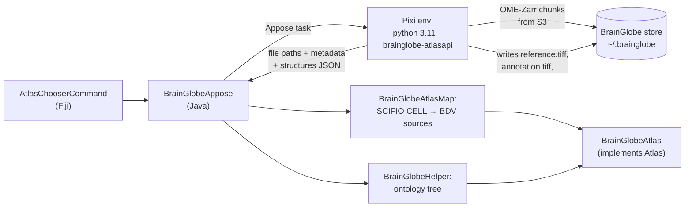

# ijp-atlas

[](https://github.com/BIOP/ijp-atlas/actions/workflows/build-main.yml)
[](https://maven.scijava.org/#browse/browse:releases:ch%2Fepfl%2Fbiop%2Fatlas)

A standard API for **brain atlases** in Fiji/ImageJ, together with a set of ready-to-use atlases.

This library is the atlas backend of [**ABBA**](https://github.com/BIOP/ijp-imagetoatlas) (Aligning Big Brains &
Atlases). It defines what an atlas *is* — a set of 3D images plus a hierarchical ontology of regions — and
provides several concrete implementations:

* **Allen Mouse Brain** CCFv3 / CCFv3.1 (native Java, BDV XML/HDF5)
* **Waxholm Sprague Dawley Rat** v4 / v4.2 (native Java, BDV XML/HDF5)
* **every [BrainGlobe](https://brainglobe.info) atlas**, through an [Appose](https://github.com/apposed/appose)
  bridge to the Python `brainglobe-atlasapi` (see [BrainGlobe integration](#brainglobe-integration-via-appose))
* **custom atlases** built from any `ImagePlus` or BDV source
* **composite atlases**, which overlay the channels of several atlases onto one reference

All images are exposed as BigDataViewer `SourceAndConverter<?>` objects, so they are lazily loaded and directly
usable by the rest of the BDV ecosystem.

---

## Table of contents

- [Installation](#installation)
- [Using an atlas from Fiji](#using-an-atlas-from-fiji)
- [BrainGlobe integration via Appose](#brainglobe-integration-via-appose)
- [Composite atlases](#composite-atlases)
- [Custom atlases](#custom-atlases)
- [The API](#the-api)
- [Registering your own atlas](#registering-your-own-atlas)
- [Where data is cached](#where-data-is-cached)
- [Building from source](#building-from-source)
- [Citing](#citing)
- [License](#license)

---

## Installation

### In Fiji

Enable the **UNIGE-Biochem** update site (`Help > Update... > Manage update sites`). This library ships with ABBA, so
installing ABBA is enough.

### As a Maven dependency

```xml
<dependency>
    <groupId>ch.epfl.biop</groupId>
    <artifactId>atlas</artifactId>
    <version>LATEST</version>
</dependency>
```

Artifacts are deployed to the [SciJava Maven repository](https://maven.scijava.org):

```xml
<repository>
    <id>scijava.public</id>
    <url>https://maven.scijava.org/content/groups/public</url>
</repository>
```

**Java 21** is required (some transitive dependencies are compiled for 21).

---

## Using an atlas from Fiji

| Menu entry | What it does |
|---|---|
| `Plugins > BIOP > Atlas > Open Atlas` | Opens the atlas chooser (`AtlasChooserCommand`) |
| `Plugins > BIOP > Atlas > Create Atlas from Images` | Builds an atlas from an open image + label image |

The chooser always offers the four built-in atlases:

| Name in the dialog | Atlas | Orientation |
|---|---|---|
| `Adult Mouse Brain - Allen Brain Atlas V3p1` | Allen CCF 2017, v3.1 | legacy (coronal-first) |
| `allen_mouse_10um_java` | Allen CCF 2017, v3.1 | `asr` |
| `Rat - Waxholm Sprague Dawley V4p2` | Waxholm SD rat v4.2 | legacy (coronal-first) |
| `whs_sd_rat_39um_java` | Waxholm SD rat v4.2 | `asr` |

plus an entry **`Get BrainGlobe Atlases...`**. Selecting it builds the Python environment (once) and repopulates
the dropdown with every BrainGlobe atlas — see the next section.

The map data of the built-in atlases is downloaded from Zenodo on first use and cached locally; their ontologies
ship with the jar.

### From a script

An atlas is a regular SciJava input/output, so any script language works:

```groovy
#@ Atlas atlas

// Nothing else to do: if no atlas is open, the "Open Atlas" dialog pops up automatically
println atlas.getName()
println atlas.getOntology().getRoot().data().get("name")
println atlas.getMap().getImagesKeys()
```

The `Atlas` parameter is filled in by `AtlasPreprocessor`, which runs `AtlasChooserCommand` when the input is
unresolved. Symmetrically, `AtlasPostProcessor` registers any `Atlas` output in the SciJava `ObjectService` and
its sources in the BDV-Playground `SourceService`, so an atlas opened once is reused rather than reloaded.

---

## BrainGlobe integration via Appose

[BrainGlobe](https://brainglobe.info) publishes dozens of atlases (mouse, rat, zebrafish, human, axolotl, fly…)
through the Python package `brainglobe-atlasapi`. Rather than reimplementing that in Java, this library talks to
the real Python package through [**Appose**](https://github.com/apposed/appose), a lightweight Java↔Python bridge
that provisions its own environment and exchanges messages with a worker process.

This replaces a previous pyimagej/JPype approach: no Python installation, no `PATH` setup and no in-process
JVM/CPython coupling are required from the user.

### Data flow



1. `BrainGlobeAppose` creates (or reuses) a **Pixi** environment named `brainglobe-abba-<version>` containing
   `python=3.11`, `appose` and `brainglobe-atlasapi`. The environment is keyed by the pinned API version
   (`BrainGlobeAppose.BG_VERSION`), so bumping it creates a fresh environment instead of mutating the old one.
2. A first script asks `get_all_atlases_lastversions()` for the list of atlas names.
3. A second script instantiates `BrainGlobeAtlas(name)` in Python, which downloads the atlas if needed,
   materializes each volume and writes it as a plain TIFF next to the atlas manifest.
4. The **file paths**, an atlas **metadata** JSON and a **structures** JSON come back as Appose task outputs — no
   pixels are passed through the bridge.
5. Java opens the TIFFs with SCIFIO in `CELL` mode (lazy, cached) and wraps them as BDV `SourceAndConverter<?>`;
   `BrainGlobeHelper` turns the structures JSON into an `AtlasNode` tree.

Everything downloaded is cached on disk, so re-opening an atlas costs a TIFF read and nothing more.

### What you get

A BrainGlobe atlas map exposes:

* `reference` — the template volume,
* one channel per **additional reference** declared by the atlas, in manifest order,
* `Left Right` — from `hemispheres.tiff`, or derived from the volume shape for symmetric atlases,
* the derived `borders`, `X`, `Y`, `Z` sources shared by all atlases,
* the annotation volume as the label image.

Structural channels get colour-blind-safe default colours (amber, blue, magenta, green, then grey), chosen to
stay separable when composited additively over the section being aligned.

### Progress and failure handling

* Environment build progress and per-volume download progress are forwarded to the SciJava `TaskService` and to
  the ImageJ status/progress bar. (BrainGlobe 3.x hard-codes a `tqdm` fsspec callback; the fetch script swaps it
  for one that reports back to the Appose task.)
* The atlas list is cached for the session with **try-once-then-give-up** semantics: if the environment cannot be
  built (no Pixi, no network), the failure is logged once, BrainGlobe atlases are simply absent from the chooser,
  and the built-in Allen/Waxholm atlases keep working.

### Notes on `brainglobe-atlasapi` 3.x

Version 3 changed the on-disk model completely, and the bridge absorbs the difference:

| | 2.x | 3.x |
|---|---|---|
| Atlas on disk | self-contained folder of TIFFs | `manifest.json` referencing separately versioned components |
| Images | local TIFFs | remote OME-Zarr pyramids, fetched chunk by chunk from S3 |
| Ontology | `structures.json` | `terminology.csv` |
| `atlas.root_dir` | the atlas folder | the shared BrainGlobe store |
| Orientation | atlas-dependent | always `asr` |

The fetch script performs the "old fashioned" whole-brain download once, caches the full-resolution volumes as
plain TIFFs beside the manifest, and rebuilds the `structures.json` payload from `atlas.structures_list`.

### From Java

```java
AtlasLocationHelper.setContext(context);          // needed: SCIFIO reads through it

BrainGlobeAtlas atlas = new BrainGlobeAtlas("example_mouse_100um");
atlas.setProgressCallback(System.out::println);
atlas.initialize(null, null);                     // URLs unused: BrainGlobe owns the data source

atlas.getOntology().getRoot();
atlas.getMap().getStructuralImages();
```

`TestBrainGlobeAppose` and `TestBrainGlobeAtlas` in `src/test/java` are runnable mains that exercise the whole
path on the small `example_mouse_100um` atlas.

---

## Composite atlases

A `CompositeAtlas` keeps the ontology, label image and coordinate conventions of a **principal** atlas, and adds
the structural channels of one or more **additional** atlases as extra channels — to overlay, say, a BrainGlobe
reference on the Allen CCF.

From the `Open Atlas` dialog, fill the *Additional atlases* field with a comma-separated list of atlas names.
From Java:

```java
Atlas composite = new CompositeAtlas(allenAtlas, brainGlobeAtlas1, brainGlobeAtlas2);
```

Channels are renamed `"<atlas name> - <channel>"`; the additional atlases' coordinate and left/right sources are
dropped, and the principal atlas' derived sources (`borders`, `X`, `Y`, `Z`) are appended last. All constituent
atlases must already be initialized.

---

## Custom atlases

`AtlasFromSourcesHelper` builds an atlas from images you already have:

```java
// From ImagePlus (structural stack + label stack)
Atlas atlas = AtlasFromSourcesHelper.fromImagePlus("My atlas", images, labelImage, 0.01);
atlas.initialize(null, null);
atlas.getOntology().initialize();

// Or from BDV sources
AtlasMap map = AtlasFromSourcesHelper.fromSources(sources, labelSource, pixelSizeMm);
Atlas custom = AtlasFromSourcesHelper.makeAtlas(map, AtlasFromSourcesHelper.dummyOntology(), "My atlas");
```

Two ontology strategies are provided: `dummyOntology()` (a single root region) and
`ontologyFromLabelImage(name, labelImage)`, which enumerates the labels actually present in the image.

The same thing is available interactively through `Plugins > BIOP > Atlas > Create Atlas from Images`, which also
registers the result in the atlas chooser for the rest of the session.

---

## The API

Four interfaces in `ch.epfl.biop.atlas.struct` describe an atlas:

| Interface | Role |
|---|---|
| `Atlas` | top-level container: a map + an ontology, plus name, URL and DOIs |
| `AtlasMap` | the imaging data — structural channels, the label image, derived sources, voxel size, coronal transform |
| `AtlasOntology` | the region hierarchy, with `getRoot()` and a fast `getNodeFromId(int)` |
| `AtlasNode` | one region: id, RGBA colour, string properties (`name`, `acronym`, `id`), parent and children |

Conventions worth knowing:

* Every image in an `AtlasMap` is a `SourceAndConverter<?>` in **millimetre** physical units.
* Beyond the atlas-specific structural channels, maps expose the derived keys `borders`, `X`, `Y`, `Z` and
  `Left Right` (`AtlasHelper.KEY_*`); `X`/`Y`/`Z` are coordinate sources used for downstream registration.
* `AtlasHelper` also serializes an ontology to/from JSON (`saveOntologyToJsonFile`, `openOntologyFromJsonFile`)
  and builds the id→node index.

### Package layout

```
ch.epfl.biop.atlas
├── struct/              core API, helpers, composite atlas
├── scijava/             AtlasChooserCommand, Atlas pre/post processors
├── custom/              atlases from ImagePlus / BDV sources
├── mouse/allen/         Allen CCFv3, CCFv3.1, CCFv3.1-ASR
├── rat/waxholm/         Waxholm SD rat v4, v4.2, v4.2-ASR
└── brainglobe/          Appose bridge, atlas, map, ontology helper
```

Each concrete atlas has a `Command` subclass annotated with `@Plugin`, which makes it discoverable by SciJava and
usable as a command output.

---

## Registering your own atlas

Any atlas can be added to the chooser at runtime:

```java
AtlasChooserCommand.registerAtlas("Zebrafish - my lab", () -> {
    MyAtlas atlas = new MyAtlas();
    atlas.initialize(mapUrl, ontologyUrl);
    return atlas;
});
```

The supplier is only called when the user picks that entry, so a lazily-downloaded atlas costs nothing until it
is selected. See `DemoAtlasInput` in `src/test/java` for a complete example.

---

## Where data is cached

* **Built-in atlases (Allen, Waxholm)** — `~/cached_atlas` by default. To use another folder, put its path in
  `plugins/BIOP/ABBA_Atlas_folder.txt` inside the Fiji installation (a disabled template ships as
  `ABBA_Atlas_folder_disabled.txt`), or set `AtlasLocationHelper.defaultCacheDir` programmatically.
* **BrainGlobe atlases** — in the BrainGlobe store (`~/.brainglobe`), managed by `brainglobe-atlasapi`; the TIFFs
  materialized by the fetch script live next to the atlas manifest.
* **The Python environment** — provisioned and cached by Appose/Pixi, keyed by the pinned `brainglobe-atlasapi`
  version.

---

## Building from source

Requires Java 21 and Maven.

```bash
mvn clean install              # build + tests
mvn clean install -DskipTests  # build only
mvn test -Dtest=TestSerialize  # a single test class
```

To launch a Fiji instance with this build for manual testing:

```bash
mvn exec:java -Dexec.mainClass="SimpleIJLaunch"
```

---

## Citing

Each atlas carries its own references: `atlas.getDOIs()` returns the DOIs to cite for the atlas you actually used
(for BrainGlobe atlases they are parsed from the BrainGlobe citation string). Please cite those, plus BrainGlobe
itself when using a BrainGlobe atlas, and ABBA if you use the alignment workflow.

Questions and bug reports are welcome on the [image.sc forum](https://forum.image.sc/) or in the
[issue tracker](https://github.com/BIOP/ijp-atlas/issues).

---

## License

MIT — see [LICENSE.txt](LICENSE.txt). Copyright (C) 2021 - 2026 EPFL and University of Geneva.

Originally developed at the [BioImaging & Optics Platform (BIOP)](https://www.epfl.ch/research/facilities/ptbiop/), EPFL,
and currently maintained at the [Department of Biochemistry](https://www.unige.ch/sciences/biochimie/), University of Geneva.
